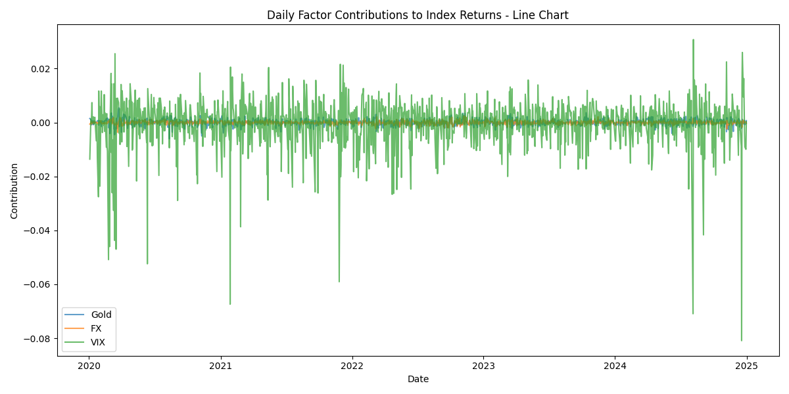
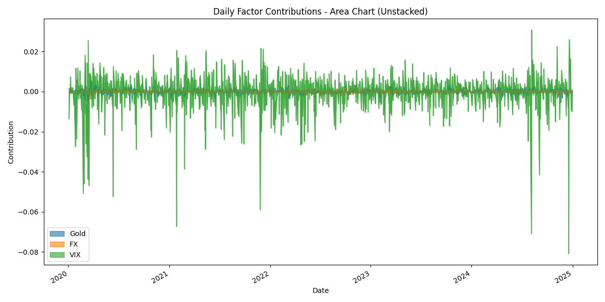
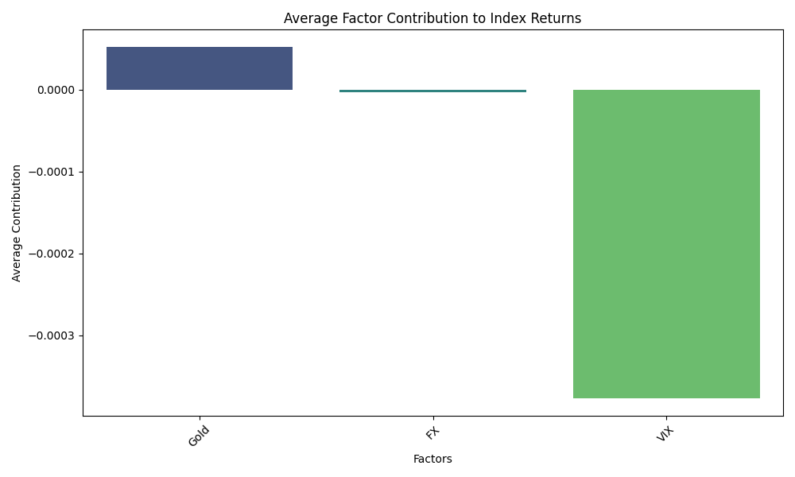
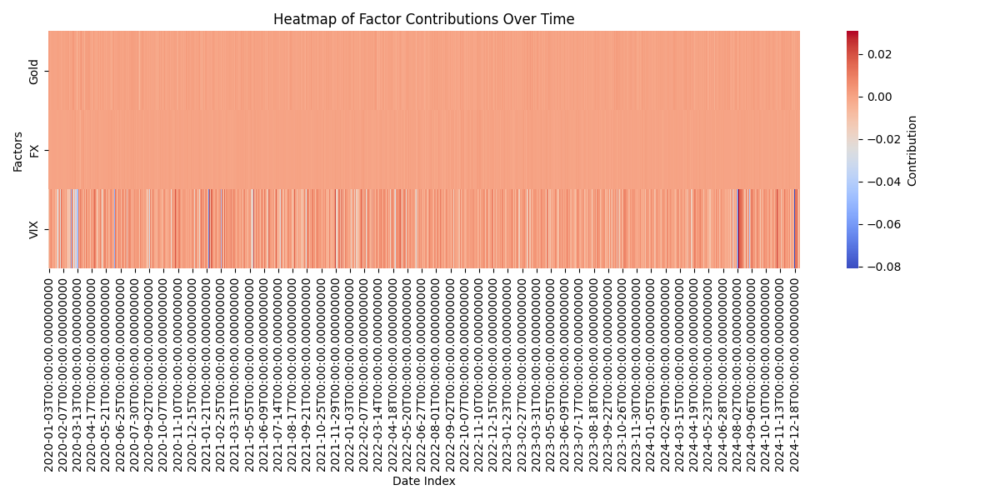

# Multi-Factor Regression Model – AI Engineer Assignment

## Overview

This project implements a multi-factor regression model that explains the growth of a stock market index (e.g., S&P 500) by attributing returns to multiple explanatory factors such as macroeconomic indicators, market factors, and volatility indices.

The model outputs:

- Machine-readable JSON with daily factor contributions.
- Human-readable summary report explaining top contributing factors.
- Visualizations of factor contributions over time.

---

## Skills Demonstrated

- Data preprocessing and feature engineering with **Pandas** and **NumPy**.
- Regression modeling using **statsmodels** (OLS) and coefficient interpretation.
- Visualization of factor attributions with **Matplotlib**.
- Ability to interpret factor contributions with economic/market intuition.
- Clean, modular, and documented Python code.

---

## Project Structure

multifactor-regression-model/

│

├─ data/

│   ├─ index_returns.csv       # Historical index returns (daily or monthly)

│   └─ factors.csv             # Factors dataset (CPI, Interest Rate, Oil, FX, VIX, etc.)

│

├─ outputs/

│   ├─ factor_contributions.json  # Machine-readable JSON of factor contributions

│   ├─ regression_coefficients.csv

│   ├─ summary_report.txt        # Human-readable summary

│   └─ factor_contributions.png  # Visualization of factor contributions

│

├─ src/

│   ├─ data_loader.py         # Fetches and prepares raw data

│   ├─ preprocess.py          # Preprocesses and aligns datasets

│   ├─ model.py               # Builds regression model and computes contributions

│   └─ visualise.py           # Plots factor contributions over time

│

└─ README.md

## 🔹 Installation

1. Clone the repository:

```bash
git clone https://github.com/yourusername/multifactor-regression-model.git
cd multifactor-regression-model
python -m venv venv
source venv/bin/activate   # Linux/Mac
venv\Scripts\activate      # Windows

python src/visualise.py

```

---

## 🔹 Output

### Machine-readable JSON

* `outputs/factor_contributions.json` contains per-day contributions of each factor and predicted returns.

Example:

[
  {
    "Date": "2020-01-01T00:00:00.000Z",
    "CPI": -0.0000027,
    "Interest_Rate": -0.0000025,
    "Oil": 0.000244,
    "FX": -0.000585,
    "VIX": -0.013643,
    "const": 0.001164,
    "Predicted_Return": -0.007059
  },
  ...
]


**Line Chart**


**Area Chart**


**Average Contribution**


**Heatmap**



### Multi-Factor Attribution Summary

CPI had a negative impact on index returns, with an average contribution of -0.00000277 per day. Inflation changes can affect purchasing power and stock valuations.
VIX had a negative impact on index returns, with an average contribution of -0.01364 per day. Higher market volatility negatively impacts returns.
FX had a positive impact on index returns, with an average contribution of 0.000585 per day. Currency fluctuations influence export/import-heavy companies.

Overall, the model explains an average of -0.00705 of daily index returns.


## 🔹 Author

Siddhant Gupta – AI Engineer / Quant Research Assignment
